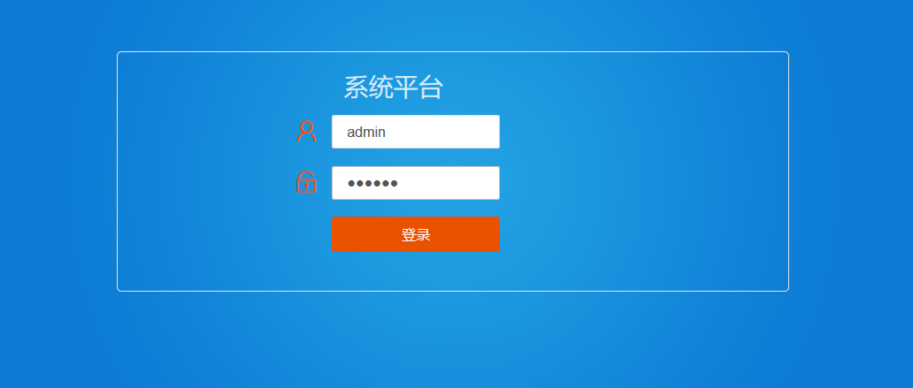
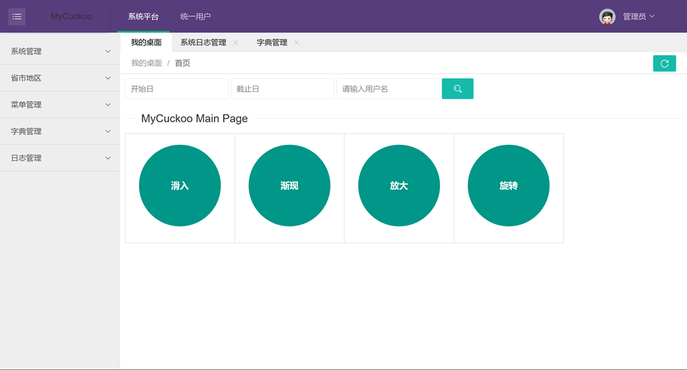
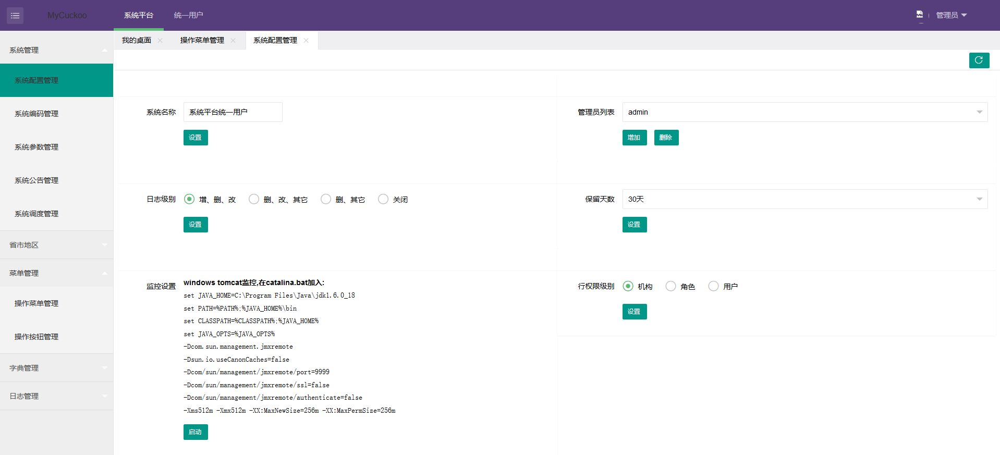

MyCuckoo-Front
========

用户权限管理平台前端

# 前述
1. 此项是笔记, 通过小而完整的一个工程记录遇到的事, 学到的经, 收集点滴
2. 此项是态度, 初有萌芽, 接而立项, 后有执行, 过程曲折, 枯燥乏味, 需心静不变的态度
3. 此项是坚持, 不畏事小, 不烦反复, 没有坚持不会有果

# 特性
1. 基于`layui`前端框架
2. 搭配后端`mycuckoo`, 实现前后端分离
3. 可独立部署, 亦可打成`jar`包被依赖(基于`webjar`技术)
4. 独立部署时修改`mycuckoo.api.js`文件的`host`所指向真实后端接口地址
5. 打成`jar`包时, 在mycuckoo中添加依赖, 直接启动mycuckoo项目, 访问地址: `localhost:8080/font/login.html`

# 效果:

登录页:

主页:

菜单管理:

系统配置:
