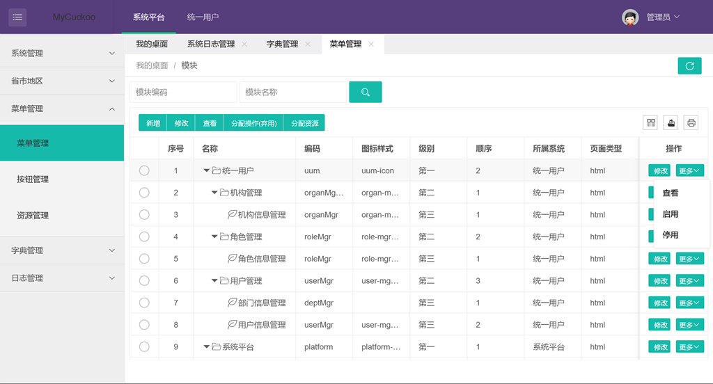

MyCuckoo-UI
========

用户权限管理平台用户界面UI

# 前述
权限控制是每个管理系统必须且基础的功能。如何更好的设计，达到便利操作和管理，也是较为困难的一件事。  

本**UI**基于后端菜单数据返回，动态渲染用户菜单和操作功能，有效拦截接口资源操作

# 特性
1. 基于`layui`前端框架
2. 搭配后端`mycuckoo`, 实现前后端分离
3. 可独立部署, 亦可打成`jar`包被依赖(基于`webjar`技术)
4. 独立部署时修改`mycuckoo.api.js`文件的`host`所指向真实后端接口地址
5. 打成`jar`包时, 在mycuckoo中添加依赖, 直接启动mycuckoo项目, 访问地址: `localhost:8080/login.html`

# 效果:

登录页:

主页:

菜单管理:

系统配置:
